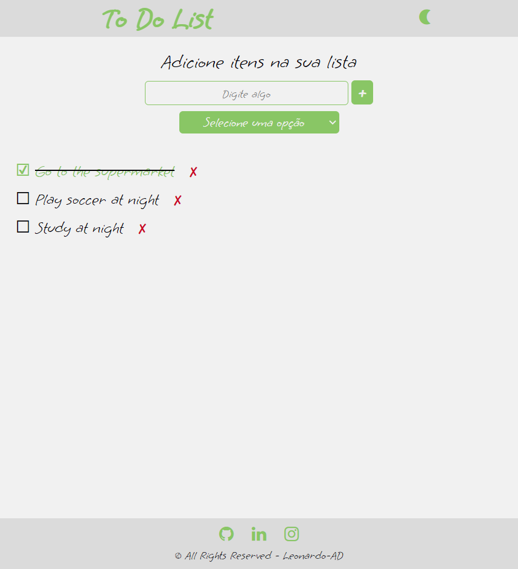
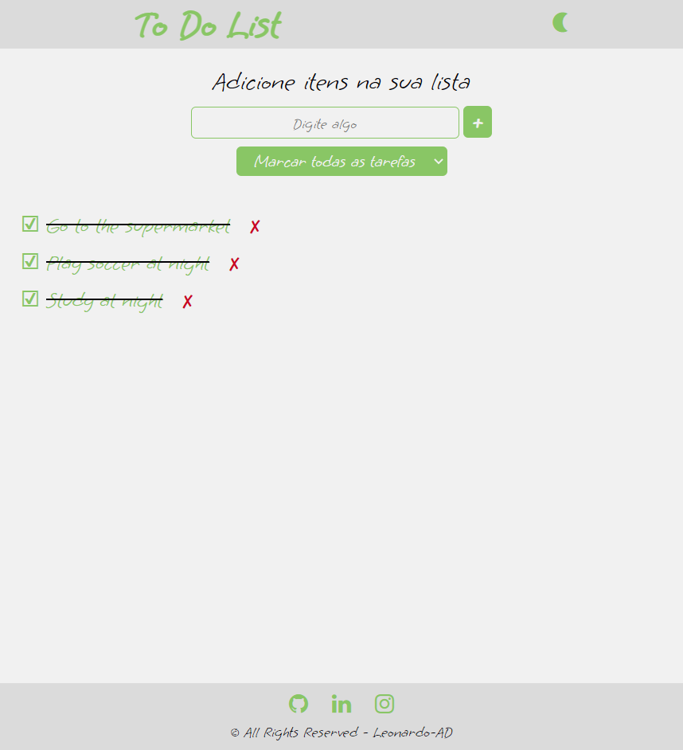
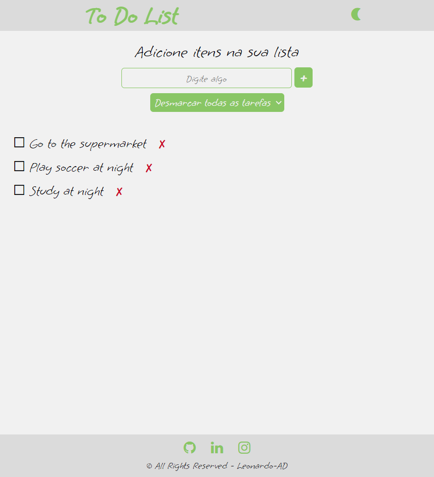
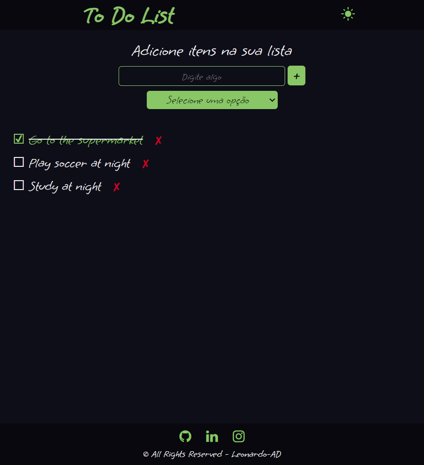
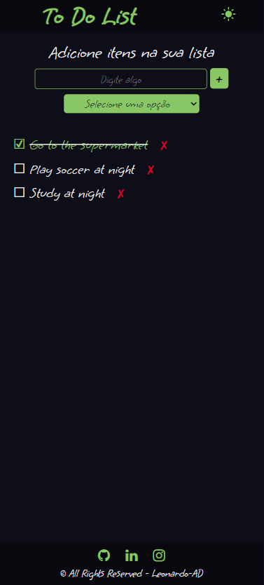

<h1 align='center'>To-Do-List</h1>

This is just a simple to do list project to improve my basic knowledge. In this app I am using HTML, CSS, JavaScript and Sweet Alert.

## Features Developed

- [x] Add tasks
- [x] Remove tasks
- [x] Check all tasks
- [x] Uncheck all tasks
- [x] Clear all tasks
- [x] Dark/Light mode
- [X] Responsivity

## Screenshots

When trying to add an empty task, an alert from the SweetAlert2 API appears

 

Adding tasks, a dropdown menu appears

Checking a task, we can delete it by clicking on the X

In the dropdown menu we can check, uncheck or delete all tasks

We have a light mode and a dark mode, to change just click on the top right icon

On mobile screens

  

## Technologies

## Services Used

</a>

## Deploy

You can access the project by clicking the button below.

